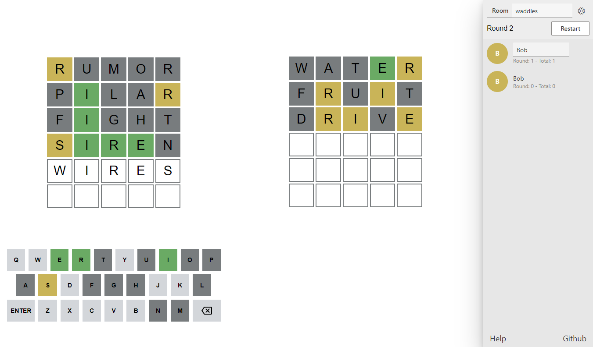

# waddles

You know? Waddles. The online PvP wordle game, playable at [waddles.herokuapp.com](https://waddles.herokuapp.com).


This game supports a variety of settings, explained in the [settings section](#settings) and supports 2+ player PvP.
This game was made within a day as a challenge (and because I didn't want to waste too much time on it) by adapting my previous game [themCards](https://github.com/TarVK/themCards).

## Gameplay

This game is modeled after [wordle](https://www.nytimes.com/games/wordle/index.html) but allows users to play against each other. To get started, simply enter [the website](https://waddles.herokuapp.com) to join a random room. If a room is available that hasn't hit its maximum capacity yet, you will enter this room. To switch rooms, simple enter another room name in the top right.

If you're the first player in a room, you are in control of the room. You can open the settings using the cog icon in the top right, and for instance make the room private. When the room is private, only people that know the room name are able to join it (so you may want to choose an uncommon name). The [settings section](#settings) describes all of the other settings that can be changed.

To play with a friend, simply send them your room name and ask them to enter, or share the url including the room name.

To start the game, simply press the "Start game!" button in the top right. ALl players can now start entering their words, and play the game similar to the regular wordle.

### Match indicator

The indicators work the same as in the wordle game:

-   If a letter is green, it's correct
-   If a letter is orange, it's in the word but not at this spot

If your guess has the same character twice and one is orange and the other is grey, the actual word only contains this character once. If your guess has the same character twice and one is orange and the other is also orange or green, the actual word also contains the character at least twice.

## UI

The game is made to support both phone and desktop usage. The site may not work properly if the phone is too small, but on the modern massive phones we have, it seems to work reasonably well. If you're planning on playing with a lot of players however, you should probably stick to desktop usage.

### Desktop

The desktop user interface contains your view on the left, and your opponents view on the right, as well as room controls and a player list.


If more than 2 players are in the match, their names will be displayed underneath their respective views. Their names also show how many wins they had in this match, and how many wins they had in total since joining the room. A player's name can also be clicked by the admin, and kicked.


When a player wins a round or a match, their name is displayed in a popup. Their profile will also get highlighted in green instead of orange.


### Mobile

In the mobile user interface the opponent's view is shrunk down in order to fit everything. The player list and game controls are hidden under a sidebar menu that can be opened by clicking the hamburger in the top right.


Here you can see the mobile user interfaces of two opposing players:


## Settings

The game has a wide variety of settings that can be used to completely change how its played. The image below shows all of these settings:


### Room

Each room can specify the number of players that are allowed in the room, and can be set to private. When a room is private, anyone that knows the room's name can still enter it, but new players won't randomly be thrown into your room by the site. By default the maximum number of allowed players is set to 2, but everything should work fine with more players too.

### Word lists

Players can change what words to play with. English word lists for words with 5, 6 and 7 characters are supported, as well as 5 letter word lists for various different languages:

-   Brazilian
-   Dutch
-   German
-   Italian
-   Spanish
-   Swedish

These word lists are obtained from public sources, and aren't perfect. For this reason, and to support more languages, people can also add their own custom word lists. This list should be a json file with the following format:

```json
["word1", "word2", "word3"]
```

Each of these words should have the exact same length, and the UI may not work well for words of more than 7 characters. Words may be prefixed with a `.` to make them valid guessing words, but not be randomly chosen as the target word. E.g.:

```json
["words", ".deice"]
```


After adding this word list, you can easily select it again at any later time:


### Modes

There are various modes that completely change how the game is played.

The scoring mode can be changed between "Fastest guess" and "Fewest attempts". Fastest guess makes the game fully time based, the fastest player wins. But of course both players are still bounded by the number of allowed attempts. Fewest attempts waits for all players to finish, and if one player has the unique smallest number of attempts, they win the round.

The word mode can be changed between "Randomly chosen" and "Entered by a player". Randomly chosen words simply choose a word from the list with equal probability. Entered by a player will cycle between players being "choosers" for a round. The chooser is prompted to enter a word that's part of the selected word list at the start of the round, and can not play in the round themselves:


The visibility mode can be changed between "Hide opponent's answers" and "Show opponent's answers". By default the answers are hidden such that people's game don't interfere with each other. Showing the opponents answers also allows for interesting games however, where players can sort of "screen cheat":



### Time management

The number of rounds for each match can be selected, such that at the end of this match an overall winner is chosen based on who won the most rounds. The scoring system however does not track how many matches are won, it only tracks how many rounds were won this match, and how many rounds were won in total.

Additionally the number of allowed attempts per word can be configured. When more than 6 attempts are specified, not all slots are rendered at once such that everything fits on the screen. Instead the rows become numbered, and the game automatically scrolls to the latest guess.

### Keyboard layout

The game currently allows both qwerty and azerty layouts to be used. For desktop usage this keyboard isn't too important, but when the game is played on a phone this may help people that use azerty.


## Development

This project is open source and may be altered/copied by anyone. As mentioned before, the initial version was thrown together in a day by adapting another project which itself was made in a weekend, so the code quality isn't as good as it could be but also isn't terrible (imo).

### Architecture/technologies

#### Backend

The backend is written in [typescript](https://www.typescriptlang.org/), for [node.js](https://nodejs.org/en/).

#### Frontend

The frontend is written in [typescript](https://www.typescriptlang.org/), and rendered with [react](https://reactjs.org/). I've used my own library [model-react](https://www.npmjs.com/package/model-react) to split the data model from the UI. A slightly outdated version of this library was used, because I took the dependencies of the old project. [fluent-ui](https://developer.microsoft.com/en-us/fluentui) was used as the base components library.

#### Communication

The server hosts the rooms and is the SSOT. Clients send commands to the server in order to alter the state, at which point the server broadcasts the change. The communication is handled by [socket.io](https://socket.io/).

### Contributing

Any contributions are appreciated, E.G.:

-   New features such as:
    -   UI translation
    -   Chatting capabilities
    -   Game modes, E.g. turn based versus mode
    -   Start countdown
    -   Prioritized word lists (such that you don't get as many weird words)
    -   Allow word lists with words of different lengths
    -   ... any number of things that I can't think of
-   Improvement of the design of the site
-   Performance / code quality improvements
-   Adding or improving the word lists

#### Installation

In order to work on this code, you will have to install [node.js](https://nodejs.org/en/download/).

then run

```
npm install
```

within the root directory of the project.

#### Running

The project contains multiple commands to run the code:

-   `npm run dev` Starts both the server and client in the same terminal
-   `npm run dev-server` Starts the server
-   `npm run dev-client` Starts the client

The server is responsible for hosting the rooms and their data. The client is responsible for hosting the resources that can be opened in the browser, at `localhost:3000`.

Either process watches for typescript code being altered and automatically compiles it to javascript and restarts the server/client. This means that you might need to fully reload the page when a change to the server took place, since it will be restarted.

#### Building

The project contains a command to build the project:

```
npm run build
```

This command will compile the typescript server code down to javascript code that can be run in node and compiles the typescript client code to a single javascript bundle that the server can serve.
When running in production, the server is responsible for both serving the static resources and hosting the rooms.

The command below can be used to run the newly built code:

```
npm run start
```
